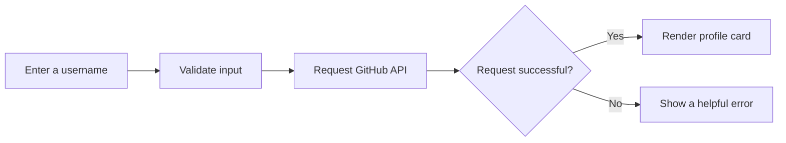

<div align="center">

# GitHub Profile Analyzer

### Turn any GitHub username into a clean, readable profile snapshot.


A responsive, dependency-free web app powered by the public GitHub Users API.

</div>

---

## ✨ What it does

Enter a GitHub username and the analyzer presents the account's public information in one focused profile card.

| Profile details | Account statistics | Experience |
| --- | --- | --- |
| Avatar, name, and username | Followers and following | Responsive dark interface |
| Bio, location, and company | Public repositories | Loading feedback |
| Website and hireable status | Public gists | Helpful error messages |
| Account creation date | Direct profile link | Keyboard-friendly search |

## 🔍 How it works



The app requests:

```text
https://api.github.com/users/{username}
```

No GitHub token is stored in the project. Requests are subject to GitHub's public API limits.

## 🚀 Run locally

No package manager, build command, or installation is required.

1. Clone the repository:

   ```bash
   git clone https://github.com/abzakir/Github-Profile-Analyzer.git
   ```

2. Open the project:

   ```bash
   cd Github-Profile-Analyzer
   ```

3. Open `index.html` in your browser.

For a local development server, you can also use an editor extension such as Live Server.

## 🧭 Using the analyzer

1. Type a GitHub username, such as `octocat`.
2. Select **Analyze profile** or press <kbd>Enter</kbd>.
3. Review the returned profile details and statistics.
4. Use **View GitHub profile** to open the profile on GitHub.

Empty input, missing users, network failures, server issues, and API rate limits produce clear feedback in the interface.

## 🗂️ Project structure

```text
Github-Profile-Analyzer/
├── index.html   # Semantic application structure
├── style.css    # Theme, layout, animation, and responsive rules
├── script.js    # Validation, API requests, state, and rendering
└── README.md    # Project documentation
```

## 🧰 Built with

- Semantic HTML5
- Modern CSS with custom properties, Grid, and Flexbox
- Vanilla JavaScript using `async`/`await`
- GitHub REST API

## ♿ Accessibility notes

- The search uses a semantic form, so pressing <kbd>Enter</kbd> works naturally.
- Status changes are announced through an ARIA live region.
- Loading, errors, and invalid input expose accessible state.
- Motion is reduced when the user's system requests it.
- Keyboard focus styles remain visible.

---

<div align="center">

Built without frameworks or external JavaScript libraries.

</div>
